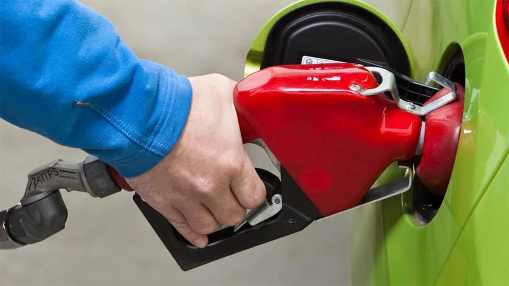

# MPG Transmission Regressions

In this project, I explored the relationship between a set of variables and miles per gallon (MPG). The sample data of interest contains 32 observation, and includes the following 11 variables: 
- Number of cylinders 
- Displacement 
- Gross horsepower 
- Rear axle ratio 
- Weight 
- 1/4 mile time 
- Engine shape, i.e., V-shaped or straight 
- Automatic (0) or manual (1) transimission 
- Number of forward gears 
- Number of carburetors 

I am particularly interested in the following two questions: 
- *Is an automatic or manual transmission better for MPG?* 
- *Quantify the MPG difference between automatic and manual transmissions.* 

I first performed a prelimanry analysis, including loading, transformation, and some summary and exploratory analysis. I showed that, in general, we expect that manual transmission works better than automatic transmission with respect to fuel economy.

Next, I considered **multivariate regression models**. Again, I selected the best fitting models, and then studied them to address our analysis questions. Some results of this project have been visualized in the following figures.

Please find the full reproducible R Markdown report [here](https://rpubs.com/asaf/MPGvsTrans_Regressions).